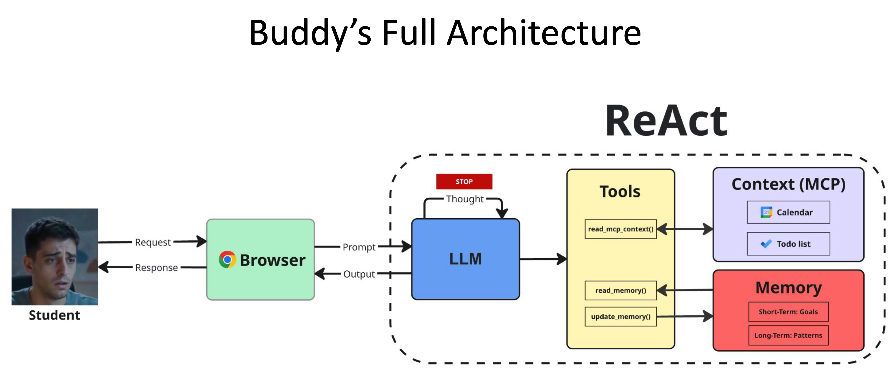

# Buddy - an AI study buddy

Buddy watches what a student opens in the browser and decides whether to leave
them alone, say something, or close the tab. It is a single LLM agent running a
hand-written ReAct loop: read the tab, look things up if looking helps, decide.

The student types in their own words - `opened youtube.com - 'lo-fi beats'`, a
pasted URL, a Hebrew sentence, half a thought. Nothing parses that before the
agent sees it. Working out which site it is, and whether it matters right now,
is the agent's job.

## What it decides

| Action | Effect |
| --- | --- |
| `allow` | Silent. No message reaches the student. |
| `nudge` | A short message. The tab stays open. |
| `lock` | Blocks this one navigation, with a reason. |

Any decision may set a `callback` - seconds until the agent wakes itself and
looks again. That is its only way to follow up, since it is otherwise called
only when the student writes.

## How it works



The loop runs turns until the model returns a decision. There is no step limit;
the ceiling is 240s of wall clock, leaving headroom under Vercel's 300s cap.
Four exits: a decision, an agent error (no browsing event in the prompt), a
deadline forcing one summarizing turn, and a stuck-agent fallback that allows
rather than hanging the browser.

Five tools. Four read the same Supabase the GUI's context panel shows; the
fifth reads the open web:

- `read_calendar()` - what is due, and when
- `read_todo_list()` - what is pending and what is done
- `read_long_memory()` - what survives past today
- `rewrite_memory(scope, text)` - overwrites `short` or `long`
- `read_website(url)` - the page's `<title>` and meta description, nothing more

`read_website` exists because the domain is not the page. A broadcaster hosts a
physics podcast and a university hosts a sports section, so "it is an
educational site" is a guess about the domain rather than a fact about the tab.
The whole HTML stays inside the tool and two short strings come out, so a page
costs the model a sentence rather than a document.

The agent may ask for several tools in one turn:

```json
{"type":"tool_call","tools":[{"tool":"read_calendar","args":{}},
                             {"tool":"read_todo_list","args":{}}]}
```

The system prompt and the examples are resent on every reasoning turn, so
two reads in one turn cost one resend instead of two. The single-call shape is
unchanged and still accepted. In the trace each tool remains its own step - a
batch changes how many turns are paid for, not what the steps look like.

Nothing in the prompt scripts which action to take, which tool to call, or when
to escalate. Those are judgment, and the agent makes them.

## Memory

Two scopes, two rows in one table, both written by the agent itself.

| Scope | Holds | How the agent sees it |
| --- | --- | --- |
| `short` | Today - which sites it nudged, how many times, what a pending callback is for | Inlined in the system prompt every turn |
| `long` | What outlives the day - which sites cost this student hours, what got them working before | Fetched with `read_long_memory()` |

Short memory is inlined rather than fetched, so there is deliberately no tool
that reads it: given the choice, the model spends a turn asking for what it can
already see, and a model that has to ask for its own history will sometimes
invent it instead. It is rendered with its age in words - `written 74 minutes
ago` - because a note is history, not current fact, and `exam in an hour` read
back an hour later is a trap the model does not otherwise notice.

`rewrite_memory(scope, text)` overwrites the whole row rather than appending, so
the agent prunes as it writes and memory stays prompt-sized. A run ends the
moment a decision is returned, so anything worth keeping has to be written
before it - a nudge that arms a callback and writes no note wakes up blind, with
no way to know which site it was for.

When short memory predates today, the prompt asks the agent to fold anything
durable into long memory and clear short - once. That comparison is done in
Python rather than left to the model, which does not reliably notice that two
dates in different paragraphs disagree.

## Layout

```
api/index.py         the four endpoints (Vercel loads one top-level app)
api/agent/loop.py    the ReAct loop
api/agent/prompts.py system prompt + few-shot examples
api/agent/tools.py   the five tools
api/agent/memory.py  Supabase reads and writes
api/agent/llm.py     OpenAI-compatible chat completions
public/index.html    the GUI, a single self-contained bundle
data/                seed data, the architecture diagram, recorded examples
supabase/schema.sql  the three tables
```

`data/calendar.json`, `data/todo-list.json` and the two `*-memory.md` files are
seed input for Supabase, not what the agent reads at runtime - it reads the
database. `data/agent_examples.json` holds the recorded runs `/api/agent_info`
returns.

## Endpoints

| Method | Path | Returns |
| --- | --- | --- |
| `POST` | `/api/execute` | `{status, error, response, steps}` |
| `GET` | `/api/team_info` | team name, students, group number |
| `GET` | `/api/agent_info` | purpose, description, prompt template, examples |
| `GET` | `/api/model_architecture` | the architecture diagram, `image/png` |
| `GET` | `/` | the GUI |

`POST /api/execute` takes `{"prompt": "..."}`. Every response carries the same
four top-level fields, and `steps` logs each turn as
`{module, prompt, response}` - the module names match the architecture diagram.

A prompt with no browsing event in it (`what should I work on?`) comes back as
`status: "error"` with the steps intact. That is the agent's judgment, not a
validation layer in front of it - the reasoning that reached "no tab here"
belongs in the trace like any other.

## Running it

```bash
pip install -r requirements.txt

export OPENAI_BASE_URL=https://api.llmod.ai/v1
export OPENAI_API_KEY=...
export BUDDY_MODEL=...
export SUPABASE_URL=https://<project>.supabase.co
export SUPABASE_SERVICE_KEY=...      # service_role, server side only

uvicorn api.index:app --reload
```

Then open http://127.0.0.1:8000.

Without Supabase configured the agent falls back to an in-process store, so it
runs but forgets everything between processes. Without an LLM endpoint it
returns `status: "error"` - there are no mocked decisions anywhere, because a
fabricated one is worse than a visible failure.

The three read-only endpoints answer with no keys configured at all:

```bash
curl localhost:8000/api/team_info
curl localhost:8000/api/agent_info
curl localhost:8000/api/model_architecture --output architecture.png
```

`/api/execute` is the one that needs an LLM endpoint:

```bash
curl -X POST localhost:8000/api/execute \
     -H 'Content-Type: application/json' \
     -d '{"prompt": "opened youtube.com - '\''lo-fi beats'\''"}'
```

`SUPABASE_SERVICE_KEY` is read server side only and never reaches the GUI.
Every decision goes through `/api/execute`; the browser never writes.

The context panel is the one exception, and it reads directly. It fetches
`memory`, `calendar_events` and `todo_tasks` over PostgREST with a publishable
key, so the panel shows the same rows the agent's tools read rather than a copy
the server passes along. RLS allows `select` and nothing else - an insert comes
back `42501 row-level security violation`, and there is no update or delete
policy at all. See `supabase/schema.sql`.

## Deploying

Vercel, from `vercel.json`. Set the five environment variables above in the
project settings - not in the repo.
